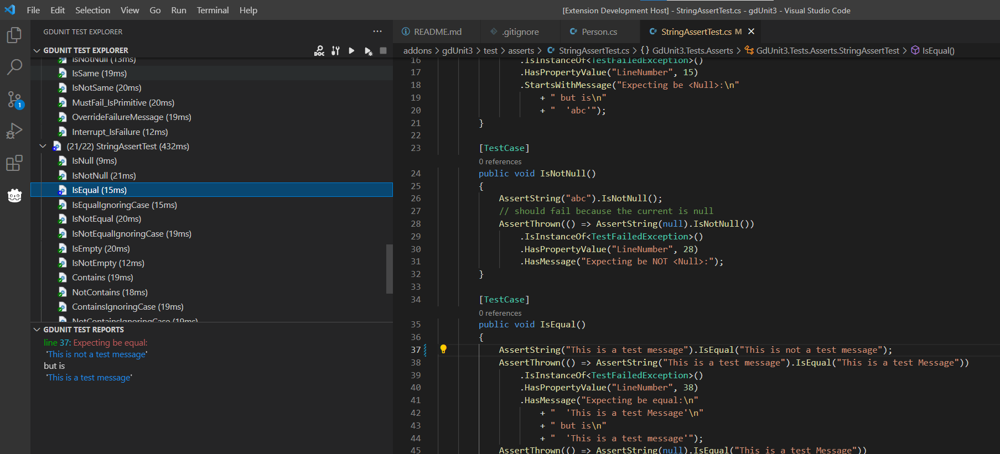

### GdUnit3 a Godot Unit Test Inspector for Visual Studio Code

This extension provides an inspector to run and debug your GdUnit3 c# tests in VS Code. 

## Release Notes

### Version 2.2.5
 - Fixed Json client/server protokoll by using a dedicated delemiter to send/receive packages
   [more details](https://github.com/MikeSchulze/gdUnit3/issues/305)
 - increased the minimum required gdUnit3 plugin to v2.2.5

### Version 2.2.4
- Fixed create test was failing on linux systems
- Improved logging
  - Colored output
  - Configurable logging level
- Extension activate/deactivate now shows/hide the icon on the activity bar
- An error is displayed when missing dependencies are detected (GdUnit3 plugin is not installed)

### 2.2.3 (HotFix)
* Fixed failing test generation (works now with and without namespaces)
* Changed minimum required GdUnit3 plugin to v2.2.3

### 2.2.2

* Add dependency check to GdUnit3 plugin v2.2.0
* Add context menu to generate a test-case from source
* Add progress bar to show current test progress
* Fix documentation link to new page

### 1.0.0 - Beta

Initial release of GdUnit3 vscode extension

-----------------------------------------------------------------------------------------------------------
## Getting started

* [Install the extension](https://mikeschulze.github.io/gdUnit3/first_steps/install/#install-visual-studio-gdunit3-extension)
* [Configure GdUnit3](https://mikeschulze.github.io/gdUnit3/first_steps/install/#gdunit3-extension-settings) to discover your tests

## Features
* Embedded test inspector to navigate over your tests
* Run or debug c# tests from the inspector
* Run or debug tests over a context menu on FileNavigator, C# editor
* Failure reporting over inspector report view
* Jump by double click to reported test failure

## Configuration
List of currently used properties:

Property                                       | Description
-----------------------------------------------|---------------------------------------------------------------
`gdunit3.godotExecutable`                      | The path to the Godot executable. Both relative and absolute paths are accepted.
`gdunit3.server.port`                          | The GdUnit server port to comunicate with the test runner client.
`gdunit3.debuger.port`                         | The c# debuger port (23685)
`gdunit3.logLevel`                             | The log level to control the output of 'gdUnitLog.log'

## Requirements
* C#
* VS Code Mono Debug
* Installed Godot-Mono 3.3.x
  * Installed GdUnit3 v2.2.3 plugin

## Known Issues

The extension is current in beta version and is not featue complete.

### You are welcome to:
  * [Give Feedback](https://github.com/MikeSchulze/gdUnit3/discussions/228)
  * [Suggest Improvements](https://github.com/MikeSchulze/vscode-extension-gdunit3/issues/new?assignees=MikeSchulze&labels=enhancement&template=feature_request.md&title=)
  * [Report Bugs](https://github.com/MikeSchulze/vscode-extension-gdunit3/issues/new?assignees=MikeSchulze&labels=bug&template=bug_report.md&title=)
